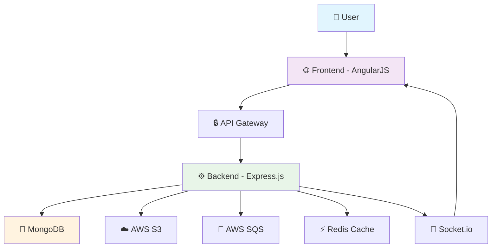
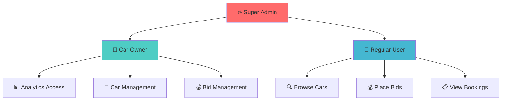
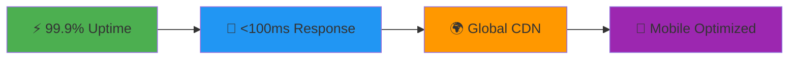

# 🚗 EZYCAR - Revolutionary Car Rental Bidding Platform

<div align="center">


**Transform the way people rent cars with our innovative bidding system!**

[](https://your-live-site.com)
[](https://github.com/yourusername/ezycar)

</div>

---

## 🌟 **What Makes EZYCAR Special?**

> **"Where Car Owners Meet Perfect Renters Through Smart Bidding!"**

EZYCAR revolutionizes the car rental industry by introducing a **dynamic bidding ecosystem** that benefits both car owners and renters. Say goodbye to fixed pricing and hello to competitive, fair market rates!

### ✨ **Why Choose EZYCAR?**

🎯 **Smart Bidding System** - Let the market decide fair rental prices  
💬 **Real-time Communication** - Instant chat between owners and renters  
📊 **Advanced Analytics** - Data-driven insights for car owners  
🔒 **Bank-grade Security** - JWT authentication with role-based access  
📱 **Responsive Design** - Perfect experience on any device  
☁️ **Cloud-powered** - AWS S3, SQS, and Redis integration

---

## 📸 **Project Showcase**

### 🖥️ **Desktop Experience**

<div align="center">

#### 🏠 **Home Dashboard**

*Clean, intuitive interface showcasing available cars with smart filtering*

#### 🚗 **Car Listing Page**

*Browse through premium car collections with detailed specifications*

#### 💰 **Bidding Interface**

*Revolutionary bidding system that makes rental pricing transparent and fair*

</div>

### 📱 **Mobile Experience**

<div align="center">

| User Dashboard | Chat Interface | Booking Flow |
|:---:|:---:|:---:|
|  |  |  |
| *Seamless mobile dashboard* | *Real-time messaging* | *Streamlined booking process* |

</div>

### 👥 **User Roles Showcase**

<details>
<summary><strong>🚙 Car Owner Experience</strong></summary>


- **Analytics Dashboard**: Track earnings, popular cars, and booking trends
- **Bid Management**: Accept or reject bids with detailed user information
- **Car Management**: Easy car listing with drag-drop image uploads

</details>

<details>
<summary><strong>🧑‍💼 Renter Experience</strong></summary>


- **Smart Search**: Find perfect cars based on location, budget, and features
- **Bid Tracking**: Monitor all your bids in real-time
- **Booking History**: Complete rental history with downloadable invoices

</details>

<details>
<summary><strong>⚙️ Admin Panel</strong></summary>


- **Platform Management**: Add new cities, car categories, and features
- **User Management**: Monitor platform activity and user engagement
- **System Analytics**: Platform-wide statistics and performance metrics

</details>

---

## 🏗️ **Cutting-Edge Architecture**

### 🎨 **Frontend Powerhouse**
- **⚡ Framework**: AngularJS (1.x) - Robust and battle-tested
- **🧭 Routing**: UI-Router - Seamless navigation experience
- **💅 Styling**: Bootstrap UI - Beautiful, responsive design
- **🔄 Real-time**: Socket.io Client - Instant updates and notifications

### 🚀 **Backend Excellence**
- **⚙️ Runtime**: Node.js - High-performance JavaScript runtime
- **🌐 Framework**: Express.js - Fast, minimalist web framework
- **💾 Database**: MongoDB with Mongoose ODM - Flexible, scalable data storage
- **🔐 Authentication**: JWT with Passport.js - Military-grade security
- **☁️ File Storage**: AWS S3 - Reliable, scalable cloud storage
- **📨 Message Queue**: AWS SQS - Robust message processing
- **💬 Real-time**: Socket.io - Lightning-fast real-time communication
- **⚡ Caching**: Redis/Upstash - Blazing fast data access

<div align="center">



</div>

## 📁 Project Structure

```
EZYCAR Hosted/
├── package.json                    # Root dependencies
├── Readme.md                      # Project documentation
├── Backend/                       # Node.js Backend
│   ├── server.js                  # Main server entry point
│   ├── queueConsumer.js          # SQS queue consumer
│   ├── package.json              # Backend dependencies
│   ├── config/                   # Configuration files
│   │   ├── db.js                 # MongoDB connection
│   │   ├── passport.config.js    # Passport JWT strategy
│   │   └── s3Config.js           # AWS S3 configuration
│   ├── controllers/              # Business logic controllers
│   │   ├── auth.controller.js    # Authentication logic
│   │   ├── car.controller.js     # Car management
│   │   ├── bidding.controller.js # Bidding system
│   │   ├── booking.controller.js # Booking management
│   │   ├── chat.controller.js    # Chat functionality
│   │   ├── field.controller.js   # Dynamic field management
│   │   └── analysis.controller.js # Analytics
│   ├── middlewares/              # Express middlewares
│   │   ├── jwtTokenAuthenticate.js # JWT validation
│   │   ├── roleAuthenticate.js   # Role-based access
│   │   ├── uploadMiddleware.js   # File upload handling
│   │   └── validation middlewares # Request validation
│   ├── models/                   # MongoDB schemas
│   │   ├── user.model.js         # User schema
│   │   ├── car.model.js          # Car schema
│   │   ├── bidding.model.js      # Bidding schema
│   │   ├── booking.model.js      # Booking schema
│   │   ├── chat.model.js         # Chat schema
│   │   └── other models          # Additional schemas
│   ├── routes/                   # API route definitions
│   │   ├── auth.route.js         # Authentication routes
│   │   ├── car.route.js          # Car routes
│   │   ├── bidding.route.js      # Bidding routes
│   │   ├── booking.route.js      # Booking routes
│   │   ├── chat.route.js         # Chat routes
│   │   ├── field.route.js        # Dynamic field routes
│   │   └── analysis.route.js     # Analytics routes
│   └── utils/                    # Utility functions
│       ├── mail.js               # Email utilities
│       └── sqs/                  # SQS utilities
│           ├── producer.js       # SQS message producer
│           └── consumer.js       # SQS message consumer
└── Frontend/                     # AngularJS Frontend
    ├── index.html                # Main HTML file
    ├── app.js                    # Main Angular module
    ├── vercel.json              # Vercel deployment config
    └── app/                     # Application source
        ├── components/          # Reusable components
        │   ├── user-navbar/     # User navigation
        │   ├── owner-navbar/    # Owner navigation
        │   ├── card/           # Car card component
        │   └── modals/         # Modal components
        ├── config/             # Application configuration
        │   └── app.routes.js   # UI-Router configuration
        ├── directives/         # Custom directives
        ├── factories/          # Angular factories
        ├── services/           # Angular services
        ├── utils/             # Utility functions
        │   └── constant.js    # Application constants
        ├── views/             # Application views
        │   ├── auth/          # Authentication views
        │   ├── user/          # User interface views
        │   ├── owner/         # Owner interface views
        │   └── super-admin/   # Admin interface views
        └── assets/            # Static assets
```

## 🗄️ **Intelligent Database Design**

<div align="center">


*Our carefully crafted database schema ensures optimal performance and scalability*

</div>

### 👤 **User Model** - *The Foundation*
```javascript
{
  name: String,                    // 📝 Full name
  email: String (unique),          // 📧 Unique identifier
  password: String (hashed),       // 🔒 Securely encrypted
  role: String,                    // 👥 'user', 'owner', 'super-admin'
  phone: Number,                   // 📱 Contact information
  verified: Boolean,               // ✅ Email verification status
  timestamps: true                 // ⏰ Auto-managed creation/update times
}
```

### 🚗 **Car Model** - *The Star of the Show*
```javascript
{
  carName: String,                 // 🏷️ Car make and model
  category: String,                // 🎯 'SUV', 'Sedan', 'Hatchback', etc.
  fuelType: String,                // ⛽ Petrol, Diesel, Electric, Hybrid
  basePrice: Number,               // 💰 Starting rental price
  pricePerKm: Number,              // 📏 Per kilometer charges
  outStationCharges: Number,       // 🛣️ Long-distance rates
  travelled: Number,               // 📊 Total kilometers driven
  city: String,                    // 📍 Available location
  imageUrl: String,                // 📸 Car photo URL
  isDisabled: Boolean,             // 🚫 Availability status
  selectedFeatures: Array,         // ✨ AC, GPS, Bluetooth, etc.
  finePercentage: Number,          // ⚠️ Damage penalty rate
  numberPlate: String,             // 🔢 Vehicle identification
  owner: {                         // 👤 Embedded owner details
    _id: ObjectId,
    name: String,
    email: String,
    role: String,
    phone: Number
  },
  timestamps: true                 // ⏰ Creation and update tracking
}
```

### 💰 **Bidding Model** - *The Game Changer*
```javascript
{
  bidAmount: Number,               // 💵 Proposed rental amount
  startDate: Date,                 // 📅 Rental start date
  endDate: Date,                   // 📅 Rental end date
  pickupLocation: String,          // 📍 Where to collect car
  dropLocation: String,            // 📍 Where to return car
  totalDistance: Number,           // 📏 Estimated travel distance
  isOutstation: Boolean,           // 🛣️ Inter-city travel flag
  status: String,                  // 🔄 'pending', 'accepted', 'rejected'
  user: UserSubModel,              // 👤 Bidder information
  car: CarSubModel,                // 🚗 Car details snapshot
  timestamps: true                 // ⏰ Bid timing details
}
```

### 📋 **Booking Model** - *Sealing the Deal*
```javascript
{
  startDate: Date,                 // 🚀 Rental period start
  endDate: Date,                   // 🏁 Rental period end
  pickupLocation: String,          // 🏃‍♂️ Collection point
  dropLocation: String,            // 🎯 Return destination
  totalAmount: Number,             // 💰 Final payment amount
  advanceAmount: Number,           // 💳 Upfront payment
  totalDistance: Number,           // 📐 Actual travel distance
  isOutstation: Boolean,           // 🌐 City boundaries crossed
  status: String,                  // 📊 'active', 'completed', 'cancelled'
  user: UserSubModel,              // 👤 Renter details
  car: CarSubModel,                // 🚗 Rented car information
  timestamps: true                 // 🕐 Booking lifecycle
}
```

## 🔐 **Fort Knox-Level Security**

<div align="center">


*Multi-layered security ensuring your data is always protected*

</div>

### 🛡️ **JWT Strategy** - *Your Digital Passport*
- **🎫 Token Generation**: Issued upon successful authentication
- **✅ Token Validation**: Passport.js JWT strategy verification
- **🔒 Role-based Access**: Granular permission control
- **🛣️ Protected Routes**: Every endpoint secured except public auth

### 👥 **User Role Hierarchy**


1. **👤 Regular User**: Browse, bid, and book cars
2. **🚙 Car Owner**: List cars, manage bids, access analytics
3. **🔥 Super Admin**: Platform configuration and management

## 🚀 **RESTful API Endpoints**

<div align="center">


*Comprehensive API documentation with interactive testing*

</div>

### 🔑 **Authentication APIs**
| Method | Endpoint | Description | 🔒 Auth Required |
|--------|----------|-------------|------------------|
| `POST` | `/api/auth/signup` | 📝 Create new account | ❌ |
| `POST` | `/api/auth/login` | 🔓 User authentication | ❌ |
| `GET` | `/api/auth/profile` | 👤 Get user profile | ✅ |

### 🚗 **Car Management APIs**
| Method | Endpoint | Description | 🔒 Auth Required | 👥 Role |
|--------|----------|-------------|------------------|---------|
| `GET` | `/api/car/getCars` | 📋 List all available cars | ✅ | All |
| `GET` | `/api/car/carId/:id` | 🔍 Get specific car details | ✅ | All |
| `POST` | `/api/car/addCar` | ➕ Add new car listing | ✅ | Owner |
| `DELETE` | `/api/car/deleteCar/:id` | 🗑️ Remove car listing | ✅ | Owner |
| `PATCH` | `/api/car/updateCar/:id` | ✏️ Update car information | ✅ | Owner |

### 💰 **Bidding System APIs**
| Method | Endpoint | Description | 🔒 Auth Required | 👥 Role |
|--------|----------|-------------|------------------|---------|
| `GET` | `/api/bidding/getBids` | 📊 Get user's bid history | ✅ | User |
| `POST` | `/api/bidding/placeBid` | 💸 Submit new bid | ✅ | User |
| `GET` | `/api/bidding/getOwnerBids` | 📈 Get received bids | ✅ | Owner |
| `POST` | `/api/bidding/acceptBid/:id` | ✅ Accept a bid | ✅ | Owner |
| `POST` | `/api/bidding/rejectBid/:id` | ❌ Reject a bid | ✅ | Owner |

### 📋 **Booking Management APIs**
| Method | Endpoint | Description | 🔒 Auth Required | 👥 Role |
|--------|----------|-------------|------------------|---------|
| `GET` | `/api/booking/getUserBookings` | 📚 User booking history | ✅ | User |
| `GET` | `/api/booking/getOwnerBookings` | 📊 Owner bookings | ✅ | Owner |
| `POST` | `/api/booking/completeBooking/:id` | ✅ Mark booking complete | ✅ | Owner |

### 💬 **Chat System APIs**
| Method | Endpoint | Description | 🔒 Auth Required |
|--------|----------|-------------|------------------|
| `GET` | `/api/chat/getConversations` | 💬 List all conversations | ✅ |
| `GET` | `/api/chat/getMessages/:conversationId` | 📨 Get chat messages | ✅ |
| `POST` | `/api/chat/sendMessage` | ✍️ Send new message | ✅ |

### 📊 **Analytics APIs**
| Method | Endpoint | Description | 🔒 Auth Required | 👥 Role |
|--------|----------|-------------|------------------|---------|
| `GET` | `/api/analysis/getOwnerAnalytics` | 📈 Owner dashboard data | ✅ | Owner |

## 🌟 **Game-Changing Features**

### 💰 **1. Revolutionary Bidding System**
<div align="center">


*Watch how our bidding system creates fair market prices*

</div>

- 🎯 **Smart Bidding**: Users compete for the best cars with competitive offers
- ⚡ **Real-time Updates**: Instant notifications when bids are placed or updated
- 🤝 **Win-Win Pricing**: Market-driven rates benefit both parties
- 📊 **Bid Analytics**: Track bidding patterns and success rates

### 💬 **2. Lightning-Fast Real-time Chat**
<div align="center">


*Seamless communication between car owners and renters*

</div>

- 🚀 **Socket.io Powered**: Instant message delivery
- 💼 **Professional Interface**: Clean, WhatsApp-like chat experience
- 📱 **Cross-platform**: Works perfectly on desktop and mobile
- 🔔 **Smart Notifications**: Never miss important messages

### 📋 **3. Comprehensive Booking Management**
<div align="center">


*Complete booking lifecycle from bid to completion*

</div>

- 🔄 **Seamless Conversion**: Transform accepted bids into confirmed bookings
- 📊 **Status Tracking**: Real-time booking status updates
- 💳 **Payment Integration**: Secure payment processing
- 📄 **Digital Invoices**: Auto-generated booking receipts

### 📤 **4. Professional File Upload System**
<div align="center">


*Drag, drop, and upload car images effortlessly*

</div>

- ☁️ **AWS S3 Integration**: Reliable cloud storage
- 🖼️ **Image Optimization**: Automatic compression and resizing
- 🔒 **Secure Uploads**: Validated file types and sizes
- 📱 **Mobile-friendly**: Upload photos directly from your phone

### 📈 **5. Advanced Analytics Dashboard**
<div align="center">


*Data-driven insights for smarter business decisions*

</div>

- 💰 **Revenue Tracking**: Monitor earnings and growth trends
- 📊 **Performance Metrics**: Car utilization and booking rates
- 👥 **Customer Insights**: User behavior and preferences
- 📈 **Predictive Analytics**: Forecast demand and optimize pricing

### ⚙️ **6. Dynamic Platform Configuration**
<div align="center">


*Flexible platform management for scalable growth*

</div>

- 🏙️ **City Management**: Easily add new service locations
- 🚗 **Category Control**: Define new car types and classifications
- ✨ **Feature Catalog**: Manage available car features and amenities
- 🔧 **Real-time Updates**: Changes reflect instantly across the platform

## 🛠️ **Powerful Technology Stack**

<div align="center">


*Built with industry-leading technologies for maximum performance*

</div>

### 🎯 **Backend Powerhouse**
```json
{
  "@aws-sdk/client-s3": "^3.797.0",        // ☁️ Cloud file storage
  "@aws-sdk/client-sqs": "^3.797.0",       // 📨 Message queuing
  "@upstash/redis": "^1.34.7",             // ⚡ Ultra-fast caching
  "bcryptjs": "^3.0.2",                    // 🔒 Password encryption
  "express": "^4.21.2",                    // 🌐 Web framework
  "express-validator": "^7.2.1",           // ✅ Input validation
  "jsonwebtoken": "^9.0.2",               // 🎫 Authentication tokens
  "mongoose": "^8.12.1",                  // 🗄️ MongoDB integration
  "multer": "^1.4.5-lts.1",               // 📤 File upload handling
  "multer-s3": "^3.0.1",                  // ☁️ Direct S3 uploads
  "passport": "^0.7.0",                   // 🛡️ Authentication strategies
  "passport-jwt": "^4.0.1",               // 🔐 JWT authentication
  "socket.io": "^4.8.1"                   // 💬 Real-time communication
}
```

### 🎨 **Frontend Excellence**
- **⚡ AngularJS (1.x)** - Battle-tested framework for complex UIs
- **🧭 UI-Router** - Advanced client-side routing
- **💅 UI-Bootstrap** - Beautiful, responsive components
- **🔄 Socket.io Client** - Real-time bidirectional communication
- **📄 jsPDF** - Professional PDF invoice generation

<div align="center">

### 🏆 **Why This Stack Rocks**

| Technology | Why We Chose It | Benefits |
|------------|----------------|----------|
| **Node.js** | 🚀 High performance | Non-blocking I/O, scalable |
| **Express.js** | ⚡ Fast & minimal | Rapid development, lightweight |
| **MongoDB** | 📈 Flexible schema | Easy scaling, JSON-like documents |
| **AWS S3** | ☁️ Reliable storage | 99.999999999% durability |
| **Socket.io** | 💬 Real-time magic | Instant updates, fallback support |
| **JWT** | 🔒 Stateless auth | Scalable, secure, industry standard |

</div>

## 🌐 **Deployment & Hosting**

<div align="center">


*Automated deployment pipeline ensuring 99.9% uptime*

</div>

### 🎨 **Frontend Deployment**
- **🚀 Platform**: Vercel - Lightning-fast edge network
- **⚙️ Configuration**: `vercel.json` for optimal performance
- **🌍 CDN**: Global content delivery for blazing speed
- **📱 Progressive**: Mobile-first responsive design

### 🔧 **Backend Infrastructure**
- **☁️ Platform**: Render - Reliable, scalable hosting
- **🔄 Auto-deploy**: Git-based continuous deployment
- **📊 Monitoring**: Real-time performance metrics
- **🔒 Security**: Automatic SSL certificates

### 🌟 **Performance Highlights**


## 📝 Environment Variables

```env
# Database
MONGO_URI=mongodb://...

# JWT
ACCESS_TOKEN_SECRET=your_jwt_secret

# AWS
AWS_ACCESS_KEY_ID=your_aws_key
AWS_SECRET_ACCESS_KEY=your_aws_secret
AWS_REGION=your_aws_region
S3_BUCKET_NAME=your_bucket_name

# Server
PORT=8000

# Redis (if using)
REDIS_URL=your_redis_url
```

## 🔍 Key Components

### Backend Middleware
- **JWT Authentication**: Validates tokens on protected routes
- **Role Authorization**: Ensures proper access control
- **File Upload**: Handles S3 uploads with validation
- **Request Validation**: Express-validator for input validation

### Frontend Services
- **Auth Service**: Handles authentication and authorization
- **Car Service**: Car-related API calls
- **Bidding Service**: Bidding system integration
- **Chat Service**: Real-time messaging
- **Analysis Service**: Analytics data fetching

### Socket.io Events
- `joinChat`: Join a specific chat room
- `sendMessage`: Send message to chat room
- `newMessage`: Receive new messages
- `newBid`: Bid notification system

## 🚦 **Quick Start Guide**

<div align="center">


*Get EZYCAR running in less than 5 minutes!*

</div>

### 📋 **Prerequisites Checklist**
- ✅ **Node.js** (v16+ recommended) - [Download here](https://nodejs.org/)
- ✅ **MongoDB** (v5+) - [Get started](https://www.mongodb.com/try/download/community)
- ✅ **AWS Account** - [Sign up](https://aws.amazon.com/) for S3 storage
- ✅ **Redis** (Optional) - [Redis Cloud](https://redis.com/try-free/) for caching

### 🚀 **Installation Steps**

#### 1️⃣ **Clone the Repository**
```bash
git clone https://github.com/yourusername/ezycar.git
cd ezycar
```

#### 2️⃣ **Backend Setup**
```bash
cd Backend
npm install
cp .env.example .env  # Configure your environment variables
npm start             # Start the main server
```

#### 3️⃣ **Queue Consumer Setup**
```bash
# In a new terminal
cd Backend
npm run consumer      # Start the SQS consumer
```

#### 4️⃣ **Frontend Setup**
```bash
cd Frontend
npm install
# Serve using your preferred method:
# - VS Code Live Server
# - Python: python -m http.server 8080
# - Node: npx serve .
```

### ⚙️ **Environment Configuration**
Create a `.env` file in the Backend directory:

```env
# 🗄️ Database Configuration
MONGO_URI=mongodb://localhost:27017/ezycar

# 🔐 Security Keys
ACCESS_TOKEN_SECRET=your_super_secret_jwt_key_here

# ☁️ AWS Configuration
AWS_ACCESS_KEY_ID=your_aws_access_key
AWS_SECRET_ACCESS_KEY=your_aws_secret_key
AWS_REGION=us-east-1
S3_BUCKET_NAME=ezycar-uploads

# 🚀 Server Configuration
PORT=8000
NODE_ENV=development

# ⚡ Redis Configuration (Optional)
REDIS_URL=redis://localhost:6379

# 📧 Email Configuration (Optional)
SMTP_HOST=smtp.gmail.com
SMTP_PORT=587
SMTP_USER=your_email@gmail.com
SMTP_PASS=your_app_password
```

### 🎯 **Quick Commands**
```bash
# 🔄 Development mode with auto-restart
npm run dev

# 🧪 Run tests
npm test

# 📊 Check code quality
npm run lint

# 🏗️ Build for production
npm run build

# 🚀 Start production server
npm run start:prod
```

## 🔮 **Exciting Roadmap**

<div align="center">


*Our vision for the future of car rentals*

</div>

### 🎯 **Phase 1: Enhanced User Experience** (Q2 2025)
- 💳 **Payment Gateway Integration** - Stripe, PayPal, and local payment methods
- 🔍 **AI-Powered Search** - Smart recommendations based on user preferences
- 📊 **Advanced Filtering** - Price range, features, availability, ratings
- ⭐ **Review System** - User ratings and feedback for cars and owners

### 📱 **Phase 2: Mobile Revolution** (Q3 2025)
- 📲 **React Native App** - Native iOS and Android applications
- 📍 **GPS Integration** - Real-time location tracking and navigation
- 🔔 **Push Notifications** - Instant alerts for bids, messages, and bookings
- 📷 **In-app Camera** - Capture and upload car damage reports

### 🤖 **Phase 3: AI & Automation** (Q4 2025)
- 🧠 **Smart Pricing** - AI-driven dynamic pricing based on demand
- 🔮 **Predictive Analytics** - Forecast demand and optimize inventory
- 💬 **Chatbot Support** - 24/7 automated customer assistance
- 🔍 **Fraud Detection** - AI-powered security and risk assessment

### 🌍 **Phase 4: Global Expansion** (2026)
- 🗺️ **Multi-language Support** - Localization for global markets
- � **Multi-currency** - Support for regional currencies
- 🌐 **International Compliance** - Adapt to local regulations
- 🤝 **Partner Integration** - Integration with insurance and travel platforms

### 🚀 **Vote for Features!**
<div align="center">

[](https://github.com/yourusername/ezycar/discussions/categories/ideas)

</div>

---

## 🤝 **Join Our Community**

<div align="center">

### **Be Part of the EZYCAR Revolution!**

[](https://discord.gg/ezycar)
[](https://twitter.com/ezycar)
[](https://linkedin.com/company/ezycar)

</div>

### 🏆 **Contributors Hall of Fame**

<div align="center">

<a href="https://github.com/yourusername/ezycar/graphs/contributors">
  
</a>

</div>

### 💡 **How to Contribute**
1. 🍴 **Fork** the repository
2. 🌟 **Create** a feature branch (`git checkout -b feature/AmazingFeature`)
3. ✅ **Commit** your changes (`git commit -m 'Add some AmazingFeature'`)
4. 📤 **Push** to the branch (`git push origin feature/AmazingFeature`)
5. 🎉 **Open** a Pull Request

---

## 📞 **Get Help & Support**

<div align="center">

### **We're Here to Help! 🚀**

| Support Type | Contact Method | Response Time |
|-------------|----------------|---------------|
| 🐛 **Bug Reports** | [GitHub Issues](https://github.com/yourusername/ezycar/issues) | 24 hours |
| 💬 **General Questions** | [Discussions](https://github.com/yourusername/ezycar/discussions) | 48 hours |
| 🔧 **Technical Support** | support@ezycar.com | 24 hours |
| 📈 **Business Inquiries** | business@ezycar.com | 48 hours |

</div>

### 📚 **Documentation & Resources**
- 📖 [**API Documentation**](https://api-docs.ezycar.com) - Complete API reference
- 🎥 [**Video Tutorials**](https://youtube.com/@ezycar) - Step-by-step guides
- 📝 [**Blog**](https://blog.ezycar.com) - Industry insights and updates
- 💻 [**Developer Portal**](https://developers.ezycar.com) - Integration guides

---

<div align="center">

## 🌟 **Show Your Support**

If EZYCAR has helped you or you believe in our vision, please consider:

⭐ **Star this repository**  
🐦 **Share on social media**  
💬 **Spread the word**  
🤝 **Contribute to the project**

---

### **Made with ❤️ by the EZYCAR Team**

[](https://github.com/yourusername)
[](https://yourportfolio.com)

**© 2025 EZYCAR. Revolutionizing Car Rentals, One Bid at a Time.**

</div>